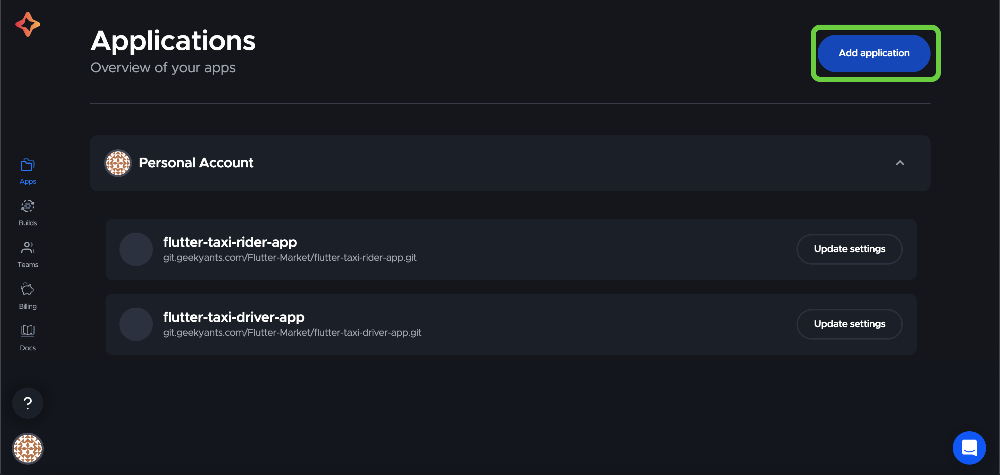
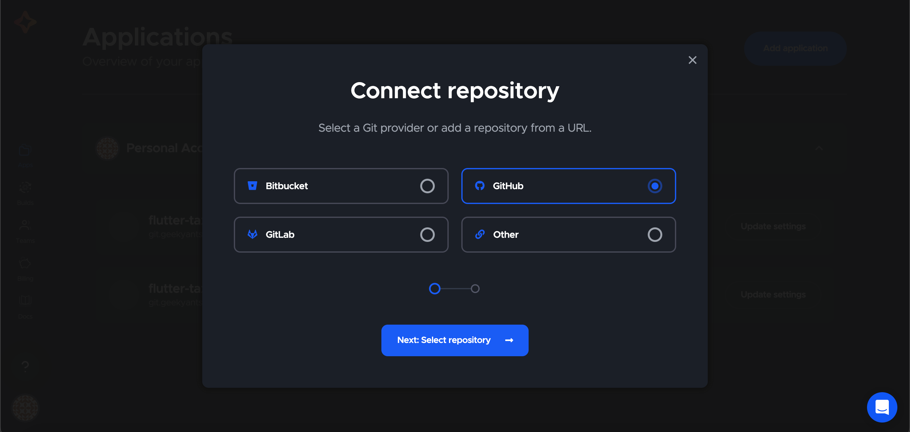
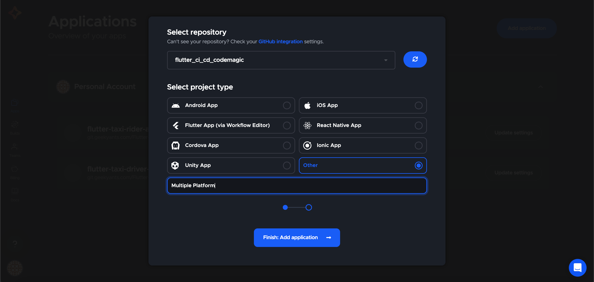
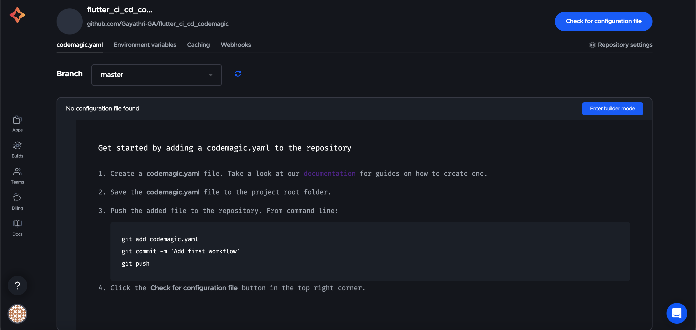

# Codemagic_App_Publish

This README.md guide provides step-by-step instructions on how to publish your mobile app to both the App Store (for iOS) and the Play Store (for Android) using Code Magic, a continuous integration and delivery (CI/CD) tool. By following this guide, you will be able to automate the build, test, and release process for your app.

## Prerequisites

1. Sign into your codemagic account
2. Create/Add a new application
   
   

3. Choose or link the repository of respected project

   

   
   
4. Read or go through the steps mentioned below for creating codemagic.yaml file.

   
   
## Configure Build and Test Workflows

Code Magic allows you to define custom workflows that determine how your app is built, tested, and deployed. Here are the key steps for configuring build and test workflows:

1. Open your Code Magic project.
2. Click on "Build" in the left sidebar to access the build configuration.
3. Modify the build configuration as per your app's requirements. This includes specifying the build script, environment variables, and any additional tools or dependencies.
4. Click on "Save changes" to update the build configuration.
5. Similarly, click on "Tests" in the left sidebar to configure test workflows. Set up test scripts, environment variables, and other necessary configurations.
6. Save the changes to update the test configuration.

## Set Up App Store and Play Store Credentials

To publish your app to the App Store and Play Store, you need to configure the necessary credentials and provisioning profiles. Here's how you can set them up in Code Magic:

### App Store

1. Generate an App Store Connect API key by following the official Apple documentation ([https://developer.apple.com/documentation/appstoreconnectapi/generating_tokens_for_api_requests](https://developer.apple.com/documentation/appstoreconnectapi/generating_tokens_for_api_requests)).
2. In your Code Magic project, go to "Environment variables" in the left sidebar.
3. Add a new environment variable named `APP_STORE_CONNECT_API_KEY` and paste the contents of the generated API key.
4. Save the changes.

### Play Store

1. Generate a service account key for your Google Play Console project by following the official Google documentation ([https://developers.google.com/android-publisher/getting_started#setting_up_api_access_clients](https://developers.google.com/android-publisher/getting_started#setting_up_api_access_clients)).
2. In your Code Magic project, go to "Environment variables" in the left sidebar.
3. Add a new environment variable named `PLAY_STORE_SERVICE_ACCOUNT_KEY` and paste the contents of the generated service account key.
4. Save the changes.

## Configure App Store and Play Store Release Workflows

Now that you have set up the necessary credentials, you can configure the release workflows for the App Store and Play Store:

### App Store

1. Open your Code Magic project.
2. Click on "Workflows" in the left sidebar.
3. Click on "Add workflow" and select the desired trigger (e.g., manual trigger or branch-specifictrigger).
4. Configure the workflow steps to build your app for iOS and generate an App Store release.
5. Add a step to upload the generated IPA file to App Store Connect using the Fastlane deliver tool or the App Store Connect API.
6. Save the workflow.

### Play Store

1. Open your Code Magic project.
2. Click on "Workflows" in the left sidebar.
3. Click on "Add workflow" and select the desired trigger (e.g., manual trigger or branch-specific trigger).
4. Configure the workflow steps to build your app for Android and generate a release APK file.
5. Add a step to upload the generated APK file to the Google Play Console using the Google Play Publisher API.
6. Save the workflow.

## Triggering the Release Workflows

Once you have configured the release workflows for both the App Store and Play Store, you can trigger them manually or set up automatic triggers based on specific conditions (e.g., branch updates, pull requests).

1. Open your Code Magic project.
2. Click on "Builds" in the left sidebar.
3. Select the desired branch or trigger option.
4. Click on "Start new build" to trigger the release workflows.
5. Monitor the build progress and check the build logs for any issues or errors.
6. Once the build and release processes are completed successfully, your app will be published to the App Store and Play Store.

## Conclusion

By following the steps outlined in this guide, you can publish your mobile app to both the App Store and Play Store using Code Magic. Automating the build, test, and release process with Code Magic saves time and ensures a consistent and reliable deployment workflow.

